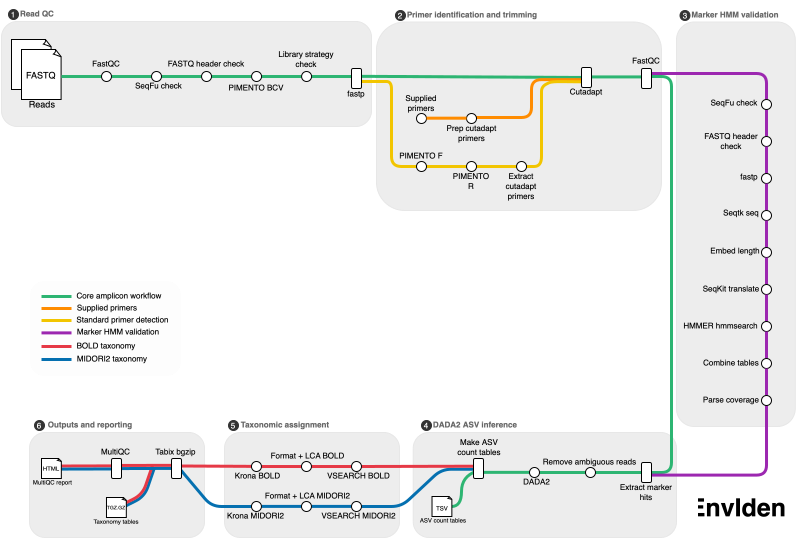

[](https://www.nextflow.io/)
[](https://github.com/nf-core/tools/releases/tag/3.3.1)
[](https://docs.conda.io/en/latest/)
[](https://www.docker.com/)
[](https://sylabs.io/docs/)

# EnvIdent - EBI-Metagenomics eDNA Analysis Pipeline

This repository contains EnvIdent v1.0.0 - EBI-Metagenomic's eDNA analysis pipeline. This pipeline is designed for the analysis of environmental DNA (eDNA) sequencing data, implementing a comprehensive workflow for quality control, primer identification, Amplicon Sequence Variant (ASV) calling and taxonomic profiling using modern bioinformatics tools.

Currently the pipeline supports analysis of Cytochrome C Oxidase subunit I (COI) metabarcoding reads with BOLD and MIDORI2 reference databases.

## Pipeline Description

<h1>
  <picture>
    <source media="(prefers-color-scheme: dark)" srcset="docs/envident_schema.svg">
    
  </picture>
</h1>


### Features

EnvIdent v1.0.0 implements the following key features:

**Quality Control and Preprocessing:**
- Raw reads quality assessment using FastQC
- FASTQ validity and library strategy checks using SeqFu, PIMENTO, and FASTQ suffix validation
- Reads quality control and filtering using fastp
- Minimum read count filtering
- FASTQ to FASTA conversion with Seqtk seq

**Primer Identification and Removal:**

The primers to be trimmed can be provided using two pathways:
- Primer inference
  - Primers are predicted using PIMENTO and a primer library
  - The primers identified and their reverse complements are extracted from a pre-prepared cutadapt primer library
- Supplied primers
  - It is possible to add the primers used for each sample to your samplesheet. EnvIdent will reverse complement them and prepare them for cutadapt. We recommend you use this approach where possible to improve the quality of your results
-  Cutadapt performs the primer trimming
-  Validation and reporting using FastQC

**Taxonomic Profiling:**
- Pfam-based COI profiling using SeqKit translate and HMMER
- Reads percentage threshold filtering for marker gene identification

**ASV Analysis:**
- Amplicon Sequence Variant (ASV) calling using DADA2
- ASV taxonomic classification using VSEARCH
- Krona chart visualization

**Reporting and Quality Control:**
- Comprehensive MultiQC reports
- Failed and passed run tracking
- Software version reporting

## How to Run

### Requirements

The pipeline requires:
- Nextflow (≥26.04.0)
- Docker, Singularity, or Conda for software management
- Access to reference databases

If not supplying your own primers the following is required:
- Forward primer library formatted for PIMENTO - a FASTA file, ending with the suffix `_F.fasta`, with contig ids ending with F for forward strand, see [here](https://github.com/EBI-Metagenomics/PIMENTO/blob/main/pimento/standard_s/V3-V5.fasta) for an example
- Reverse primer library formatted for PIMENTO - a FASTA file, ending with the suffix `_R.fasta`, with contig ids ending with R for reverse strand
- A directory containing primer libraries prepared for cutadapt containing four FASTA files with the same sequences as provided for PIMENTO. The file names need to end with the suffixes listed below:
  - `_F.fasta` - The forward primer sequences with formatting to allow for anchoring non-internal adaptors, for example `XN{25}TGTAAAA`, which allows for up to 25 bases before your primer. If you don't wish to do this anchoring you can just include your primer sequences
  - `_R.fasta` - The reverse primer sequences with formatting to allow for anchoring non-internal adaptors
  - `_F_RC.fasta` - The reverse complement of the forward primers. If you wish to use similar anchoring for these the syntax is moved to the end, eg. `GAGAAN{25}X`.
  - `_R_RC.fasta` - The reverse complement of the reverse primer.
 
  Please note, primer sequences must use standard IUPAC nucleotide codes, including IUPAC ambiguity codes where applicable. An 'I' will be substituted with an 'N' automatically in both supplied and PIMENTO primer identification routes.
  

### Reference Databases

This pipeline uses the following reference databases:

| Database | Purpose | Default Location |
|----------|---------|------------------|
| Pfam | COI read identification | Configurable via parameters |
| BOLD | COI taxonomic classification | Configurable via parameters |
| MIDORI2 | COI taxonomic classification | Configurable via parameters |

You must give a marker gene specific HMM model to EnvIdent to identify any COI reads. Supply it with `--pfam_coi_db`; our COI HMM model is available [here](https://ftp.ebi.ac.uk/pub/databases/envident/reference_databases/pfam/coi.hmm).

Running with both COI reference databases is enabled by default (`run_coi_bold = true` and `run_coi_midori2 = true`). 
Supply their paths with `--coi_bold_ref_db` and `--coi_midori2_ref_db`. Use `--run_coi_bold false` or `--run_coi_midori2 false` to skip a database. Set both run_coi_bold and run_coi_midori2 to false to generate ASVs and read counts without taxonomic assignments or Krona reports.
> Our MIDORI2 reference database is available to download [here](https://ftp.ebi.ac.uk/pub/databases/envident/reference_databases/midori2/midori2_coi_gb272.udb).
> Our BOLD reference database is available to download [here](https://ftp.ebi.ac.uk/pub/databases/envident/reference_databases/bold/bold_coi_30-06-26.udb).


### Input Format

The input data should be eDNA sequencing reads (paired-end or single-end) in FASTQ format, specified using a CSV samplesheet. If you know what primers were used for each sample you can include them in the spreadsheet by using the optional columns forward_primer and reverse_primer. By default all supplied primers will be formatted to allow for anchoring non-internal adaptors by 25 nucleotides. If you wish to modify this behaviour then use the `bases_allowed_before_primer` option.

```csv
sample,fastq_1,fastq_2,forward_primer,reverse_primer,single_end
sample1,/path/to/sample1_R1.fastq.gz,/path/to/sample1_R2.fastq.gz,TTCTCAACCAACCANAANGANATNGG,GCTCCTATTGATARWACATARTGRAAATG,false
sample2,/path/to/sample2.fastq.gz,,TTCTCAACCAACCANAANGANATNGG,GCTCCTATTGATARWACATARTGRAAATG,true
```
> [!NOTE]
> EnvIdent has not yet been optimised for single-end reads, the parameters used as default may not be optimal
> 
> EnvIdent does not currently support FASTQ files with binned quality scores or paired-end reads with insufficient overlap for merging (e.g. where the amplicon is longer than approximately twice the read length).

### Basic execution

```bash
nextflow run EBI-Metagenomics/envident \
    -r main \
    -profile example_slurm \
    --input samplesheet.csv \
    --outdir results
```

### Key Parameters

<table>
  <thead>
    <tr>
      <th width="300">Parameter</th>
      <th width="100">Default</th>
      <th>Description</th>
    </tr>
  </thead>
  <tbody>
    <tr>
      <td><code>--min_read_count</code></td>
      <td><code>1</code></td>
      <td>Minimum number of reads required per sample</td>
    </tr>
    <tr>
      <td><code>--reads_percentage_threshold</code></td>
      <td><code>0.10</code></td>
      <td>Minimum fraction of reads matching COI profile (0–1)</td>
    </tr>
    <tr>
      <td><code>--std_primer_library</code></td>
      <td>None</td>
      <td>Directory containing forward (<code>*F.fasta</code>) and reverse (<code>*R.fasta</code>) PIMENTO primer libraries</td>
    </tr>
    <tr>
      <td><code>--cutadapt_primers</code></td>
      <td>None</td>
      <td>Directory containing forward (<code>*F.fasta</code>), reverse (<code>*R.fasta</code>), reverse complemented forward (<code>*F_RC.fasta</code>) and reverse complemented reverse (<code>*R_RC.fasta</code>) Cutadapt prepared primer libraries</td>
    </tr>
    <tr>
      <td><code>--bases_allowed_before_primer</code></td>
      <td><code>25</code></td>
      <td>Number of bases allowed before primer sequence by Cutadapt</td>
    </tr>
    <tr>
      <td><code>--pfam_coi_db</code></td>
      <td>None</td>
      <td>Path to Pfam COI HMM database</td>
    </tr>
    <tr>
      <td><code>--run_coi_bold</code></td>
      <td><code>true</code></td>
      <td>Run COI taxonomic classification against BOLD</td>
    </tr>
    <tr>
      <td><code>--run_coi_midori2</code></td>
      <td><code>true</code></td>
      <td>Run COI taxonomic classification against MIDORI2</td>
    </tr>
    <tr>
      <td><code>--coi_bold_ref_db</code></td>
      <td>None</td>
      <td>Path to the BOLD COI reference database UDB or FASTA file used for taxonomic classification.</td>
    </tr>
    <tr>
      <td><code>--coi_midori2_ref_db</code></td>
      <td>None</td>
      <td>Path to the MIDORI2 COI reference database UDB or FASTA file used for taxonomic classification.</td>
    </tr>
    <tr>
      <td><code>--idcutoff</code></td>
      <td><code>0.5</code></td>
      <td>Minimum percentage identity for VSEARCH</td>
    </tr>
  </tbody>
</table>

### Taxonomic assignment

Taxonomy is assigned using VSEARCH. After optimization we found these settings gave us the best results:
 - Percentage identity threshold - `0.5`
 - Query coverage - `0.9`
 - Maxaccepts - `50000`
 - Maxrejects - `1000`
 - Maxhits - `1000`
   
Two Lowest Common Ancestor (LCA) scripts are then run on the VSEARCH output. A percentage identity threshold has to be met for each rank for it to be included in the LCA calculation. You can edit the percentage identity thresholds in `bin/top_lowest_common_ancestor.js` and `bin/all_lowest_common_ancestor.js`. The `top` LCA script only includes hits with the highest percentage identity in its calculation. The `all` LCA script includes all hits above the percentage identity threshold. We've observed that the `top` results have increased precision, at the expense of recall; for the `all` results the opposite is true.

### Optional input preparation

Set `--skip_standardise false` to standardise FASTQ headers with BBMap before
QC. For interleaved paired-end reads, set `single_end` to `false`, provide the
interleaved file in `fastq_1`, and leave `fastq_2` empty. Standardisation splits
it into paired files; it is skipped by default.

On the EBI network, `--use_fire_download` downloads ENA FTP/HTTP read paths via
FIRE before QC or standardisation. This requires the Nextflow secrets
`FIRE_ACCESS_KEY` and `FIRE_SECRET_KEY`. FIRE downloading is disabled by default.

### Configuration Profiles

`--dada2_merge_mode` supports `standard` and `gap`. Separate-strand mode is
currently disabled.

The pipeline includes pre-configured profiles:

* docker: Use Docker containers
* singularity: Use Singularity containers
* conda: Use Conda environments
* example_slurm: Optimised for SLURM clusters
* example_macbook: Optimised for MacBooks
* test: Small test dataset for validation

## Outputs

A MultiQC quality report is generated per sample and includes separate sections for initial and pre-HMM fastp QC,
both Cutadapt passes, raw and clean FastQC, and a DADA2 read/ASV retention table.
DADA2 fractions use a 0–1 scale; software versions and run parameters are also included.

All taxonomy TSVs and the ASV read-count table are BGZIP-compressed (`.tsv.gz`),
each with a matching `.tsv.gz.gzi` index. QC tables, DADA2 statistics and
primer-summary tables remain plain TSVs. The indexes describe compressed
blocks, rather than genomic coordinates. The directory tree below omits the
`.gzi` files for readability.

Taxonomy filenames use `<sample>_<database>_<description>`. The database labels
come from `--bold_label` (default `BOLD`) and `--midori2_label`
(default `MIDORI2`); each label controls both the folder and filename prefix.

The `qc_passed` and `qc_failed` CSV files are generated when samples pass or fail, respectively. The `qc_passed.csv` contains the id of each of the runs that passed. The `qc_failed.csv` contains the id of a failed run and the reason for failure which includes:

| Error message | Meaning |
| --- | --- |
| seqfu_fail | Failed SeqFu check |
| sfxhd_fail | Failed the suffix header check - FASTQ id's didn't end with the correct suffixes |
| libstrat_fail | Failed the library strategy check - not amplicon sequence data |
| min_reads_fails | The run didn't contain enough reads |
| empty_after_qc | Following cutadapt no reads remained | 
| reads_percentage_fail | Too few reads matched the HMM model | 
| dada2_stats_fail | DADA2 failed |
| no_asvs | No ASVs were called |

### Key Output Files

* **MultiQC Report**: Comprehensive quality control summary across all samples
* **ASV Sequences**: FASTA files containing called Amplicon Sequence Variants
* **Taxonomic Classifications**: TSV files with taxonomic assignments for ASVs
* **Krona Charts**: Interactive HTML visualisations of taxonomic composition
* **QC Summary Files**: Lists of samples that passed or failed quality control steps

### Output directory structure

Example output structure for a sample (sample1):
```bash
results/
├── sample1/
│   ├── asv/
│   │   ├── sample1_asv_read_counts.tsv.gz
│   │   ├── sample1_asvs.fasta
│   │   └── sample1_dada2_stats.tsv
│   ├── hmmsearch-COI/
│   │   ├── sample1_Pfam-A.domtbl
│   │   └── sample1_Pfam-A.txt
│   ├── primer-identification/
│   │   ├── sample1.first_pass.cutadapt.json
│   │   ├── sample1.second_pass.cutadapt.json
│   │   ├── sample1_F.fasta
│   │   ├── sample1_F_RC.fasta
│   │   ├── sample1_R.fasta
│   │   ├── sample1_R_RC.fasta
│   │   ├── sample1_first_pass_1_summ.tsv
│   │   ├── sample1_first_pass_2_summ.tsv
│   │   ├── sample1_second_pass_1_summ.tsv
│   │   └── sample1_second_pass_2_summ.tsv
│   ├── qc/
│   │   ├── sample1_beforehmm_seqfu.tsv
│   │   ├── sample1_beforehmm_suffix_header_err.tsv
│   │   ├── sample1_initial.fastp.json
│   │   ├── sample1_multiqc_report.html
│   │   ├── sample1_seqfu.tsv
│   │   └── sample1_suffix_header_err.json
│   ├── taxonomy-summary/
│   │   ├── BOLD/
│   │   │   ├── sample1_BOLD_krona_lca_all_hits.html
│   │   │   ├── sample1_BOLD_krona_lca_all_hits_counts.tsv.gz
│   │   │   ├── sample1_BOLD_krona_lca_top_hits.html
│   │   │   ├── sample1_BOLD_krona_lca_top_hits_counts.tsv.gz
│   │   │   ├── sample1_BOLD_taxonomy_lca_all_hits.tsv.gz
│   │   │   ├── sample1_BOLD_taxonomy_lca_top_hits.tsv.gz
│   │   │   ├── sample1_BOLD_vsearch_hits_for_lca.tsv.gz
│   │   │   ├── sample1_BOLD_vsearch_hits_with_accessions.tsv.gz
│   │   │   └── sample1_BOLD_vsearch_raw_hits.tsv.gz
│   │   ├── MIDORI2/
│   │   │   ├── sample1_MIDORI2_krona_lca_all_hits.html
│   │   │   ├── sample1_MIDORI2_krona_lca_all_hits_counts.tsv.gz
│   │   │   ├── sample1_MIDORI2_krona_lca_top_hits.html
│   │   │   ├── sample1_MIDORI2_krona_lca_top_hits_counts.tsv.gz
│   │   │   ├── sample1_MIDORI2_taxonomy_lca_all_hits.tsv.gz
│   │   │   ├── sample1_MIDORI2_taxonomy_lca_top_hits.tsv.gz
│   │   │   ├── sample1_MIDORI2_vsearch_hits_for_lca.tsv.gz
│   │   │   ├── sample1_MIDORI2_vsearch_hits_with_accessions.tsv.gz
│   │   │   └── sample1_MIDORI2_vsearch_raw_hits.tsv.gz
├── pipeline_info/
│   ├── execution_report_YYYY-MM-DD_HH-mm-ss.html
│   ├── execution_timeline_YYYY-MM-DD_HH-mm-ss.html
│   ├── execution_trace_YYYY-MM-DD_HH-mm-ss.txt
│   ├── params_YYYY-MM-DD_HH-mm-ss.json
│   ├── pipeline_dag_YYYY-MM-DD_HH-mm-ss.html
│   └── envident_software_mqc_versions.yml
├── qc_passed_runs.csv
└── qc_failed_runs.csv
```

| Description | Contents |
| --- | --- |
| `vsearch_raw_hits.tsv.gz` | Original VSEARCH output, without a header. The columns are ASV, reference hit, percentage identity, query coverage, alignment length. The reference hit contains the accession, taxid and taxonomy. |
| `vsearch_hits_with_accessions.tsv.gz` | Readable hits with the standard taxonomy ranks, retaining reference database accessions |
| `vsearch_hits_for_lca.tsv.gz` | Individual hits with the standard taxonomy ranks, percentage identity and query coverage for LCA script input |
| `taxonomy_lca_all_hits.tsv.gz` | ASV assignments calculated from all hits above the percentage identity threshold at the selected rank |
| `taxonomy_lca_top_hits.tsv.gz` | ASV assignments from highest-identity qualifying hits, above the percentage identity threshold at the selected rank |
| `krona_lca_all_hits_counts.tsv.gz`, `krona_lca_top_hits_counts.tsv.gz` | Headerless, read-weighted counts grouped by taxonomy; includes unclassified reads |
| `krona_lca_all_hits.html`, `krona_lca_top_hits.html` | Interactive reports for the respective assignment method |

For LCA input, the matching genus prefix is removed from the species label first.
If the first remaining underscore-separated word contains `.`, eg. `sp.`, the species rank
is left empty (`s__;`). Hits in the accessions output file retain the full label after genus removal.

Taxonomy uses eight ranks: domain, kingdom, phylum, class, order,
family, genus, and species. Missing ranks retain empty placeholders.

ASVs without reference hits remain in the output tables. Raw VSEARCH rows use
`*` for the missing target. Both formatted tables and LCA assignment tables
retain the ASV ID with `d__;k__;p__;c__;o__;f__;g__;s__;`. Formatted no-hit rows
have an empty accession and `NA` identity/coverage where those columns are present.
Their reads remain included under `Unclassified` in the Krona counts and reports.

`asv/<sample>_asv_read_counts.tsv.gz` is generated once per sample, counting nonzero forward-map
entries for the filtered reads from DADA2. Counts are independent of taxonomy and
are generated even when both database branches are disabled.

Both final `taxonomy_lca_all_hits.tsv.gz` and `taxonomy_lca_top_hits.tsv.gz` files are
headerless, with columns `ASV ID`, `taxonomy`, and `count`. The third column comes
from the shared ASV read counts table.

`sample1_first_pass_1_summ.tsv` and `sample1_first_pass_2_summ.tsv` contain summarised primer trimming locations for R1 and R2 of the first pass of cutadapt. `*_second_pass_*tsv` show the same for the second pass.

`sample1_Pfam-A.domtbl` is the Pfam-A HMM search domain-table output for identified COI sequences. `sample1_Pfam-A.txt` contains information on the proportion of reads matching the HMM model.

The MultiQC report contains results from the same sample at multiple stages through the pipeline. The following suffixes indicate these stages of the pipeline:
 - Raw - FastQC results for the raw reads
 - Initial - Quality statistics published by fastp the first time it is run
 - First pass - Cutadapt results where the forward and reverse primers were trimmed
 - Second pass - Cutadapt results where the reverse complemented forward and reverse primers were trimmed
 - Clean - FastQC results for the adaptor and primer cleaned reads
 - Beforehmm - Quality statistics published by fastp the second time it is run

## Tools

| Tool | Version | Purpose |
|------|---------|---------|
| [BBmap](https://bbmap.org) | 39.33 | Optional FASTQ standardisation |
| [cutadapt](https://cutadapt.readthedocs.io/en/stable/)  | 5.2 |  Primer trimming |
| [DADA2](https://benjjneb.github.io/dada2/index.html)   | 1.40.0 | ASV calling and denoising |
| [fastp](https://github.com/OpenGene/fastp)  | 1.3.6 | Read quality control and filtering |
| [FastQC](https://github.com/s-andrews/fastqc) | 0.12.1 | Read quality control |
| [HMMER](http://hmmer.org/) | 3.4 | Profile HMM searching for COI sequences |
| [Krona](https://github.com/marbl/Krona)  | 2.8.1 | Interactive taxonomic visualization |
| [VSEARCH](https://github.com/torognes/vsearch)  | 2.32.0 | Taxonomic classification of ASVs |
| [mgnify-pipelines-toolkit](https://github.com/EBI-Metagenomics/mgnify-pipelines-toolkit) | 1.5.4 | Toolkit containing various in-house processing scripts |
| [MultiQC](https://github.com/MultiQC/MultiQC) | 1.35 | Aggregated quality control reporting |
| [Node.js](https://nodejs.org/en/blog/release/v24.0.0) | 24.0.0 | JavaScript runtime environment |
| [PIMENTO](https://github.com/EBI-Metagenomics/PIMENTO)  | 1.3.3 |  Primer identification and inference |
| [SeqFu](https://telatin.github.io/seqfu2/) | 1.27.1 | FASTQ validity check |
| [SeqKit](https://bioinf.shenwei.me/seqkit/) | 2.13.0 | Read extraction and protein tranlsation |
| [Seqtk](https://github.com/lh3/seqtk) | 1.5 | FASTQ conversion to FASTA |
| [Tabix](https://academic.oup.com/bioinformatics/article/27/5/718/262743) | 1.20 | Compressing and indexing tsvs |


## Citations

This pipeline uses code developed and maintained by the [nf-core](https://nf-co.re) community, reused here under the [MIT license](https://github.com/nf-core/tools/blob/master/LICENSE).

> **The nf-core framework for community-curated bioinformatics pipelines.**
>
> Philip Ewels, Alexander Peltzer, Sven Fillinger, Harshil Patel, Johannes Alneberg, Andreas Wilm, Maxime Ulysse Garcia, Paolo Di Tommaso & Sven Nahnsen.
>
> _Nat Biotechnol._ 2020 Feb 13. doi: [10.1038/s41587-020-0439-x](https://dx.doi.org/10.1038/s41587-020-0439-x).
